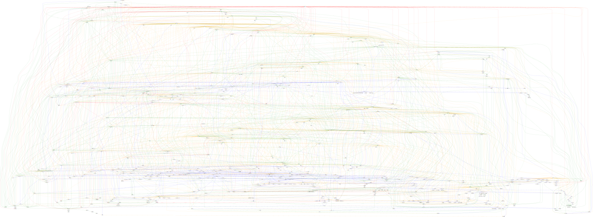
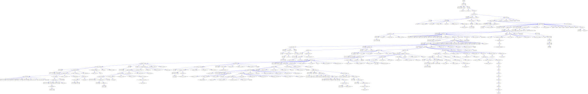
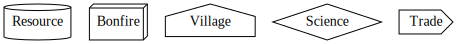
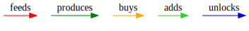

# idle-game-engine

Game engine for idle games like kittens game.

## Code

- [game.go](game/game.go) general game engine
- [data.go](data/data.go) representation of the data
- [ui.go](ui/ui.go) representation of the UI
- [textui.go](textui/textui.go) text UI
- [simple.go](examples/simple/simple.go) run simple game
- [kittens.go](kittens/kittens.go) kittens game
- [main.go](main.go) run kittens game
- [game.out](kittens/testdata/game.out) json representation of kittens game, including generated formulas
- [solve.go](kittens/solve/solve.go) solution to kittens game
- [solve.out](kittens/testdata/solve.out) text UI output for solution to kittens game
- [graph.go](kittens/graph/graph.go) generate graph of kittens game dependencies
- [graph.svg](kittens/testdata/graph.svg) graph of kittens game dependencies
- [graph_blue.svg](kittens/testdata/graph_blue.svg) graph of kittens game unlocks

## Special Actions

- Time skip until a game action is available
- Create all the inputs for an action
- Max an action (skip, create, buy)

## Dev

Run tests and build:

```
$ go test ./... && go build
```

## Run

Run interactive kittens game:

```
$ ./idle-game-engine
```

Use text UI or http://localhost:8080/.

Set starting resources:

```
$ ./idle-game-engine --resource_map='catnip:100,Catnip Field:1'
```

Watch kittens game solution:

```
$ ./idle-game-engine --auto
```

Faster solution:

```
./idle-game-engine --auto --auto_sleep_ms=100
```

## General Ideas

- shared web server
- configurable game rules at runtime
- competition of best solutions
  - least actions
  - least skipped time
- competition of bots

## Kittens

Graph of features:



Graph of unlocks:



Nodes:



Edges:



More features from kittens game:

- https://wiki.kittensgame.com/en/home
  - https://wiki.kittensgame.com/en/game-tabs/workshop
    - Antimatter Reactors

- Tradepost
  - Trade +1.5%
  - Caravanserai - Trade Relations +0.35%
    - Each Tradepost improves standings by +0.35%
- Factory
  - Space Manufacturing - Space Bonus +3.75
    - Increases Space Bonus from Space Elevators and Orbital Arrays by 3.75% per factory. (4.5% with Factory Logistics) Does not apply to Planet Crackers.
- AI Core
  - Machine Learning - Data Center effectiveness +10% per AI Core
- Relic Station
  - your relic production scales with your antimatter storage. Each storage unit below 5000 will decrease production by 0.02%
- Steamworks Automation
  - Workshop Automation	Converts (2 + 2\*(# of Steamworks))% of wood (to beams) and minerals (to slabs) at 98% of that resource's cap
  - Advanced Automation	Workshop Automation will be activated twice per year
  - Pneumatic Press	Workshop Automation will also convert iron to plates
- Global Production
  - Magneto
    - Steamworks Magneto Boost
  - Reactor
- Astronomical Events
- Meteors
- Reset
  - Chronosphere
    - Resource Preservation +1.5%
    - Flux Condensator - Craftable Resource Preservation +1.5%
      - 1.5 * # of Chronospheres * Sqrt(resource amount) of each craftable resource is carried over on reset.
- Engineer
- Energy
  - Broadcast Tower
    - Culture per Tick +(1\*Energy Surplus Ratio)
    - Max Culture +(300\*Energy Surplus Ratio)
    - Satellite Radio - Culture per Tick, Max Culture +0.5% per Satellite
      - Broadcast Towers' max culture and culture production is increased by 0.5% per active Satellite (multiplies with other effects)
- Pollution
- Diminishing Returns and Limits
  - e.g. Each trade ship adds +1% to harbor capacity with diminishing returns past 168.75% and a limit of 225%
- Festivals
- Compendium Cap
- Kitten Skills
- Space Travel Speed
- Blackcoin Market
- Iron Will
