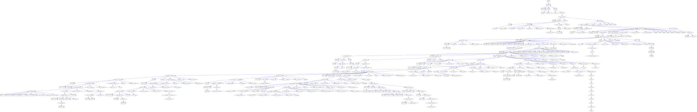

# idle-game-engine

Game engine for idle games like kittens game.

## Code

- [game.go](game/game.go) general game engine
- [data.go](data/data.go) representation of the data
- [ui.go](ui/ui.go) representation of the UI
- [textui.go](textui/textui.go) text UI
- [simple.go](examples/simple/simple.go) run simple game
- [kittens.go](kittens/kittens.go) kittens game
- [main.go](main.go) run kittens game
- [game.out](kittens/testdata/game.out) json representation of kittens game, including generated formulas
- [solve.go](kittens/solve/solve.go) solution to kittens game
- [solve.out](kittens/testdata/solve.out) text UI output for solution to kittens game
- [graph.go](kittens/graph/graph.go) generate graph of kittens game dependencies
- [graph.svg](kittens/testdata/graph.svg) graph of kittens game dependencies
- [graph_blue.svg](kittens/testdata/graph_blue.svg) graph of kittens game unlocks

## Special Actions

- Time skip until a game action is available
- Create all the inputs for an action
- Max an action (skip, create, buy)

## Dev

Run tests and build:

```
$ go test ./... && go build
```

## Run

Run interactive kittens game:

```
$ ./idle-game-engine
```

Use text UI or http://localhost:8080/.

Set starting resources:

```
$ ./idle-game-engine --resource_map='catnip:100,Catnip Field:1'
```

Watch kittens game solution:

```
$ ./idle-game-engine --auto
```

Faster solution:

```
./idle-game-engine --auto --auto_sleep_ms=100
```

## General Ideas

- shared web server
- configurable game rules at runtime
- competition of best solutions
  - least actions
  - least skipped time
- competition of bots

## Kittens

Graph of features:


Graph of unlocks:



Nodes:


Edges:


Missing features:

- [Cycles](https://wiki.kittensgame.com/en/general-information/game-mechanics#cycles)
- [Events](https://wiki.kittensgame.com/en/general-information/events)
- [Metaphysics paragon effect and scaling](https://wiki.kittensgame.com/en/game-tabs/science/metaphysics)
- [Metaphysics price ratios](https://wiki.kittensgame.com/en/game-tabs/science/metaphysics)
- [Reset](https://wiki.kittensgame.com/en/general-information/game-mechanics#reset)
- [Space Travel Speed](https://wiki.kittensgame.com/en/game-tabs/space)

- [AI Apocalypse](https://wiki.kittensgame.com/en/general-information/events/ai-apocalypse)
- [Achievements](https://wiki.kittensgame.com/en/game-tabs/achievements)
- [Blackcoin](https://wiki.kittensgame.com/en/general-information/resources/blackcoin)
- [Challenges](https://wiki.kittensgame.com/en/game-tabs/challenges)
- [Dark Future](https://wiki.kittensgame.com/en/general-information/events/dark-future)
- [Diminishing Returns and Limits](https://wiki.kittensgame.com/en/guides-and-advice-and-stuff/diminishing-returns)
- [Energy](https://wiki.kittensgame.com/en/general-information/resources/energy)
- [Engineer](https://wiki.kittensgame.com/en/game-tabs/outpost/engineer)
- [Iron Will](https://wiki.kittensgame.com/en/game-tabs/challenges/iron-will)
- [Kitten Skills](https://wiki.kittensgame.com/en/general-information/resources/kittens#kitten-list)
- [Pacts](https://wiki.kittensgame.com/en/game-tabs/religion#pacts)
- [Policies](https://wiki.kittensgame.com/en/game-tabs/science/policies)
- [Pollution](https://wiki.kittensgame.com/en/general-information/game-mechanics/pollution)
- [Resource Retrieval](https://wiki.kittensgame.com/en/game-tabs/time#resource-retrieval)
- [Trade Attitude and Embassy](https://wiki.kittensgame.com/en/game-tabs/trade)

TODO:

- record terminal using https://asciinema.org/
- make [solve.go](kittens/solve/solve.go) get everything
