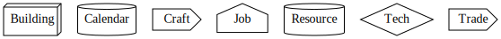

# idle-game-engine

Game engine for idle games like kittens game.

## Code

- [game.go](game/game.go) general game engine
- [data.go](data/data.go) representation of the data
- [ui.go](ui/ui.go) representation of the UI
- [textui.go](textui/textui.go) text UI
- [simple.go](examples/simple/simple.go) run simple game
- [kittens.go](kittens/kittens.go) kittens game
- [main.go](main.go) run kittens game
- [solve.out](kittens/testdata/solve.out) text UI output for kittens game solution
- [graph.svg](kittens/testdata/graph.svg) graph of kittens game dependencies

## Special Actions

- Time skip until a game action is available

## Dev

Run tests and build:

```
$ go test ./... && go build
```

## Run

Run interactive kittens game:

```
$ ./idle-game-engine
```

Use text UI or http://localhost:8080/.

Set starting resources:

```
$ ./idle-game-engine --resource_map='catnip:100,Catnip Field:1'
```

Watch kittens game solution:

```
$ ./idle-game-engine --auto
```

Faster solution:

```
./idle-game-engine --auto --auto_sleep_ms=100
```

## General Ideas

- shared web server
- configurable game rules at runtime
- competition of best solutions
  - least actions 
  - least skipped time
- competition of bots

## Kittens

Graph of current features:


Nodes:



Edges:


More features from kittens game:

- Workshop
  - craft 6%
- Civil Service
  - unlocked by Animal Husbandry
  - science 1500
  - TODO
- Mathematics
  - unlocked by Animal Husbandry
  - science 1000
  - TODO
- Construction
  - unlocked by Animal Husbandry
  - science 1300
  - TODO
- Pasture
  - unlocked by Animal Husbandry
  - catnip 100 115 rate 1.15
  - wood 10 11.5
  - catnip demand -0.5%
- Unic. Pasture
  - unlocked by Animal Husbandry
  - unicorns 2 TODO
  - unicorns 0.005/s
  - capnip consumption -0.15%
- TODO
- maybe
  - rX: revert action X
    - sell building
    - unassign worker
